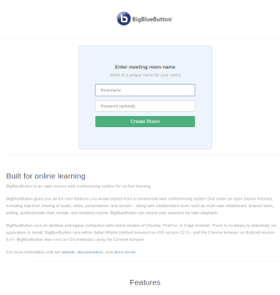
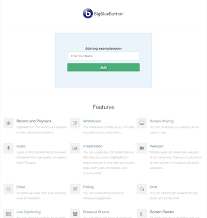

bbb-easy-join
-------------

An easy frontend to BigBlueButton without signups - everybody can just enter a meeting room name and an optional password.
The first user gets moderator level access.


 

### Setup

Tested with an BBB instance installed with [bbb-install.sh](https://github.com/bigbluebutton/bbb-install). Can be run next to greenlight on the same machine by using different subdirectory and port. Can also be run on a different machine than BBB using below instructions.

Installation requires git and bbb to be installed on the same machine

```bash
sudo apt install git
```

Checkout this repository to /var/www/bbb-easy-join

```
git clone https://github.com/svoeth/bbb-easy-join.git /var/www/bbb-easy-join
sudo chown -r bigbluebutton: /var/www/bbb-easy-join
sudo -iu bigbluebutton
cd /var/www/bbb-easy-join
npm install
```

Create an `.env` file (use `.env.sample` as a template) and enter your BBB API URL and Secret there. You can get these by running `sudo bbb-conf --secret`.

For serving the pages, copy `bbb-easy-join.nginx` to `/etc/bigbluebutton/nginx/`. If there is already `greenlight-redirect.nginx` you have to decide which subdirectory gets served by nginx if calling $DOMAIN/.
Either remove `greenlight-redirect.nginx` or remove redirect in `bbb-easy-join.nginx` beforce copying (remove last 3 lines).

You can start the service by running `/usr/bin/node /var/www/bbb-easy-join/app.js`
If you want to keep the service running in background and on startup:
```bash
# copy the systemd service file and register it with systemd
cp bbb-easy-join.service /etc/systemd/system/
sudo systemctl daemon-reload
# activate it to start on startup
sudo systemctl enable bbb-easy-join
# start it immediately 
sudo systemctl start bbb-easy-join
```
### Change subdirectory
```bash
cd /var/www/bbb-easy-join/
sed -i 's|/easy|/subdirname|g' app.js bbb-easy-join.nginx views/index.ejs views/join.ejs 
systemctl reload nginx && systemctl restart bbb-easy-join.service
```
Now bbb-easy-join is served on /subdirname (change to your likeings)

### run on a different server than bbb
The frontend van be run on a different server than the actual bbb. 

Installation requires git and nodejs 12 to be installed on the same machine

```bash
curl -sL https://deb.nodesource.com/setup_12.x | sudo -E bash -
sudo apt install git nodejs
```

Checkout this repository to /var/www/bbb-easy-join

```
git clone https://github.com/svoeth/bbb-easy-join.git /var/www/bbb-easy-join
cd /var/www/bbb-easy-join
npm install
```

Add the line `user


### Note

Your BigBlueButton Instance is then (if not only reachable from inside your network or protected otherwise) public, everybody can create and moderate/present in a meeting. Therefore, you may want to think about disabling recordings, the security of accepting presentation files etc.

### Credits

HTML template, css and images are from the [bigbluebutton default pages](https://github.com/bigbluebutton/bigbluebutton/tree/master/bigbluebutton-config/web).

BigBlueButton and the BigBlueButton Logo are trademarks of [BigBlueButton Inc](http://bigbluebutton.org).

